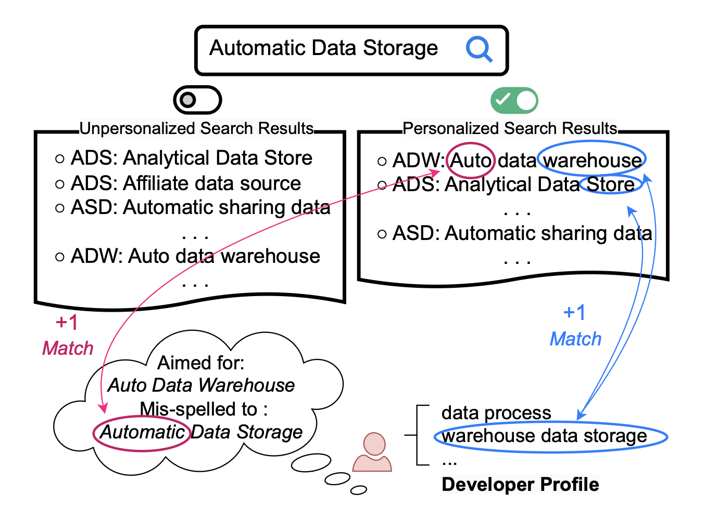
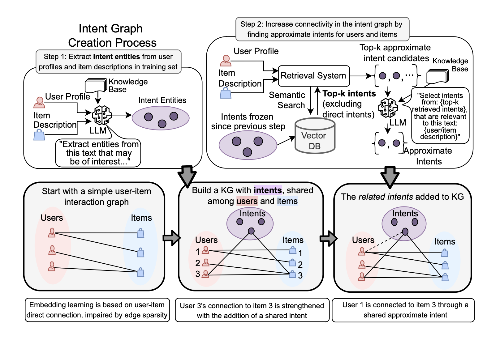

## Tuning-Free LLM Can Build A Strong Recommender Under Sparse Connectivity And Knowledge Gap Via Extracting Intent

### Abstract

Recent advances in recommendation with large language models (LLMs) often rely on either commonsense augmentation at the item-category level or implicit intent modeling on existing knowledge graphs. However, such approaches struggle to capture grounded user intents and to handle sparsity and cold-start scenarios. In this work, we present LLM-based Intent Knowledge Graph Recommender (IKGR), a novel framework that constructs an intent-centric knowledge graph where both users and items are explicitly linked to intent nodes extracted by a tuning-free, RAG-guided LLM pipeline. By grounding intents in external knowledge sources and user profiles, IKGR canonically represents what a user seeks and what an item satisfies as first-class entities. To alleviate sparsity, we further introduce a mutual-intent connectivity densification strategy, which shortens semantic paths between users and long-tail items without requiring cross-graph fusion. Finally, a lightweight GNN layer is employed on top of the intent-enhanced graph to produce recommendation signals with low latency. Extensive experiments on public and enterprise datasets demonstrate that IKGR consistently outperforms strong baselines, particularly on cold-start and long-tail slices, while remaining efficient through a fully offline LLM pipeline.







This repo is a concise, production-friendly implementation for *intent-centric recommender (IKGR)*:

1) **Step 1** extracts user & item intents from plain profiles via a **local HTTP LLM** (OpenAI-compatible).

2) **Step 2** freezes an **intent vocabulary**, builds a KNN index with sentence embeddings, and uses **RAG** to expand *related* intents (still gated by LLM selection from the fixed vocab).

3) **Step 3** converts intents into a lightweight **KG** (user_has_intent / item_has_intent), and trains a two-layer IKGR in RecBole.


### Quick start

#### 0) Install
```bash
pip install -r requirements.txt
export PYTHONPATH=$PYTHONPATH:$(pwd)   # so RecBole can find ikgr_core.model_ikgr.IKGR
```

#### 1) Configure

Edit `config.yaml`:

- `paths.input_csv`: your profiles. Must contain:

  - user_id,user_profile,item_id,item_profile

- `paths.inter_file`: interactions (CSV) with columns:

  - user_id,item_id,rating

- `llm.base_url` / `llm.model`: your local OpenAI-compatible LLM server.

- `rag.encoder`: any SentenceTransformers model.


#### 2) Run pipeline

```bash
python step1.py     # extract exact intents
python step2.py     # RAG expand related intents (from fixed vocab)

# If you want to use step 3 to run inference under recbole infra, you need to convert to recbole format and run steps below.
python convert_to_recbole_atomic.py \
  --interactions data/interactions.csv \
  --intents run/step2_related_intents.csv \
  --out_dir data \
  --dataset ikgr-custom

python build_intent_banks.py \
  --step2_csv run/step2_related_intents.csv \
  --encoder sentence-transformers/all-mpnet-base-v2 \
  --user_out run/user_bank.pt \
  --item_out run/item_bank.pt

python step3.py     # build KG + train/eval IKGR in Recbole. Optional if you want to run intent graph KG with other infra.
```

#### Goodreads JSONL (.json.gz) -> CSV

If you have Goodreads JSONL files (e.g., `goodreads_interactions_children.json.gz` and
`goodreads_books_children.json.gz`), convert them to the pipeline CSVs first:

```bash
python goodreads_preprocess.py \
  --interactions_gz goodreads_interactions_children.json.gz \
  --books_gz goodreads_books_children.json.gz \
  --out_profiles data/profiles.csv \
  --out_interactions data/interactions.csv
```

Artifacts go to run/ by default (see config.yaml).

#### 3) Input File formats

- profiles.csv (input):

  - user_id,user_profile,item_id,item_profile. You may repeat rows per (user,item) pair if desired; step scripts aggregate row-wise.

- interactions.csv:

  - user_id,item_id,rating

- Optional: KG triples (kg_triples.txt):

  - tab-separated: head    relation    tail

- relations used: user_has_intent, item_has_intent
