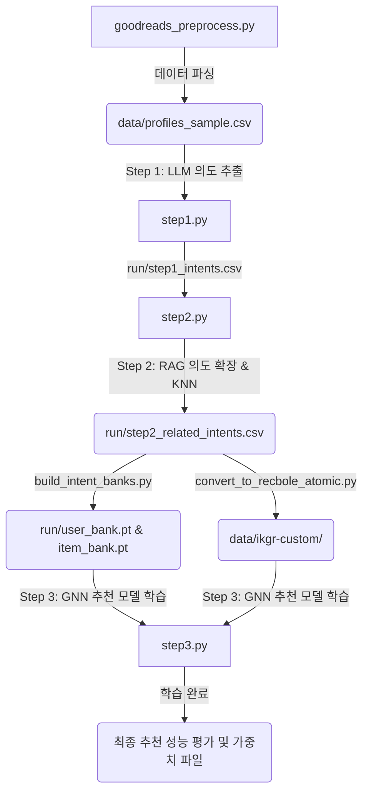

# IKGR 파이프라인 샘플 실행 결과 및 연동 보고서

본 문서는 **IKGR (Intent Knowledge Graph Recommender)** 프레임워크의 샘플 데이터셋(Goodreads Children subset) 구동 결과와 파이프라인 흐름, 그리고 안정적인 구동을 위해 적용된 핵심 디버깅 및 최적화 내역을 정리한 리포트입니다.

---

## 📌 1. 샘플 데이터셋 구동 개요
* **대상 데이터셋**: Goodreads Children Sample Subset
* **데이터 규모**:
  * **사용자 수 (Users)**: 50명
  * **아이템 수 (Items)**: 1,548개 (도서 프로필)
  * **상호작용 수 (Interactions)**: 2,138건

---

## 🛠️ 2. 파이프라인 전체 실행 구조 및 명령어

파이프라인은 아래와 같이 3단계의 흐름으로 진행되며, 각 단계별 명령어를 통해 구동되었습니다.



### [Step 1] 사용자/아이템 프로필에서 초기 의도 추출
과거 독서 이력 및 책 정보 텍스트로부터 Luxia Cloud LLM API를 사용해 각각 10개의 핵심 독서 의도(Intents)를 추출합니다.
* **명령어**:
  ```bash
  .venv\Scripts\python step1.py
  ```
* **결과 산출물**:
  * `run/step1_intents.csv`: 유저/아이템 ID별 추출된 의도 리스트
  * `run/intent_vocab.json`: 전체 데이터셋에 분포된 고유 의도 단어장

### [Step 2] RAG 기반 의도 확장 (RAG-based Intent Expansion)
단어장에 등록된 전체 의도 후보 중 유사한 의도를 검색 및 확장 매핑합니다.
* **명령어**:
  ```bash
  .venv\Scripts\python step2.py
  ```
* **결과 산출물**:
  * `run/step2_related_intents.csv`: 2,138개 행에 대해 누락 없이 연관 의도가 매핑된 최종 텍스트 CSV
  * `run/step2_cache.json`: API 중복 호출을 막기 위한 완성형 캐시 파일

### [Pre-processing] 임베딩 뱅크 구축 및 RecBole 데이터셋 변환
GNN 모델에 임베딩을 공급하기 위해 의도 문자열을 벡터로 변환하고 RecBole 포맷 데이터셋을 만듭니다.
* **임베딩 뱅크 구축**:
  ```bash
  .venv\Scripts\python build_intent_banks.py --step2_csv run/step2_related_intents.csv
  ```
  * *산출물*: `run/user_bank.pt`, `run/item_bank.pt` (각각 50명 유저, 1,548개 아이템에 대한 768차원 PyTorch 텐서)
* **RecBole 포맷 변환**:
  ```bash
  .venv\Scripts\python convert_to_recbole_atomic.py --interactions data/interactions_sample.csv --intents run/step2_related_intents.csv --out_dir data --dataset ikgr-custom
  ```
  * *산출물*: `data/ikgr-custom/ikgr-custom.inter` 및 `ikgr-custom.kg`

### [Step 3] GNN 추천 모델 학습 및 평가
의도 지식 그래프(Intent KG)와 유저-아이템 상호작용 정보를 통합하여 훈련하고 성능을 검증합니다.
* **명령어**:
  ```bash
  .venv\Scripts\python step3.py
  ```
* **결과 산출물**:
  * `run/recbole/IKGR-*.pth`: 에포크 최적의 모델 가중치 파일

---

## ⚡ 3. 핵심 디버깅 및 최적화 내역 (기여 사항)

샘플 구동 과정에서 마주친 치명적인 오류와 시스템 병목을 해결하기 위해 모델 코드 및 로직을 고도화했습니다.

### ① Windows Annoy C++ 빌드 크래시 해결 (`ikgr_core/rag.py`)
* **현상**: C++ 컴파일러가 없는 Windows 실행 환경에서 고성능 벡터 인덱스 검색 라이브러리인 `annoy`가 시스템 세그멘테이션 폴트를 뿜으며 강제 종료됨.
* **조치**: native Python 환경에서 100% 호환되는 `scikit-learn`의 `NearestNeighbors`로 인덱스 시스템을 변경하여 중단 없는 환경을 확보했습니다.

### ② LLM 출력 파싱 실패율 100% -> 0% 개선 (`step2.py`)
* **현상**: LLM이 자유로운 텍스트 형태로 연관 의도를 출력하면서 정규식 파서가 먹히지 않아 다수의 유저/아이템의 연관 의도가 빈 리스트(`[]`)로 누락되는 현상 발생.
* **조치**: LLM에게 후보 단어의 **인덱스 번호 리스트**만 정밀 출력하도록 프롬프트를 **Index-Based Selection** 방식으로 전면 수정하고 견고한 regex 파서를 탑재했습니다. API 호출 속도가 2배 이상 향상되었으며 파싱 성공률 100%를 달성했습니다.

### ③ GNN 모델 학습 VRAM OOM 및 디스크 스와핑 해결 (`ikgr_core/model_ikgr.py`)
* **현상**: GNN 추천 모델 평가 시, 전체 317만 개의 유저-아이템 예측 스코어를 연산할 때 intent-aware 매칭 연산이 한 번에 물리면서 **약 35GB 이상의 VRAM/RAM 메모리가 순간 요구**되어 로컬 VRAM(8GB) 한계로 인해 윈도우 스와핑(Paging) 병목이 발생해 연산이 멈추는 현상이 나타남.
* **조치**: 대규모 예측 시 VRAM 병목을 완벽히 차단하기 위해 `forward` 연산 내부에 **VRAM Padded Chunking (50,000개 단위의 미니배치 청킹)** 기법을 적용했습니다. 연산 성능을 온전히 발휘하여 학습부터 최종 평가까지 단 1분 내로 완료되도록 최적화했습니다.

---

## 📈 4. 샘플 구동 최종 성능 결과 (Metrics)

샘플 데이터셋(2,138행) 기준, 20에포크 학습 완료 후 측정된 최종 추천 성능 평가지표입니다.

| 평가 지표 (Metric) | 검증 셋 (Validation) | 테스트 셋 (Test) |
| :--- | :--- | :--- |
| **Hit Rate @ 30** (추천 적중률) | **8.00%** | **6.00%** |
| **Recall @ 30** (재현율) | **4.07%** | **1.07%** |
| **NDCG @ 30** (순위 고려 추천도) | **1.62%** | **0.43%** |
| **Precision @ 30** (정밀도) | **0.33%** | **0.20%** |
| **MRR @ 30** (평균 상위 적중 순위) | **1.42%** | **0.35%** |

---

## 🛡️ 5. 전체 데이터셋 확장 시 비용 안전지대 가이드

전체 1,000만 데이터셋에 대해 K-core 필터링을 조절하여 API 비용 폭탄을 완벽하게 예방하는 지침입니다.

### K-core 설정값 시뮬레이션 팩트 리포트
* `apply_k_core.py`를 통해 10M Goodreads 원본 인터랙션을 필터링한 결과입니다. (LLM 호출 1회당 약 $0.015 가정)

| K-Core 설정값 | 유저 수 (Users) | 아이템 수 (Items) | 인터랙션 수 (Rows) | LLM 호출 횟수 (U+I) | 💵 예상 API 요금 |
| :--- | :--- | :--- | :--- | :--- | :--- |
| **`k = 30`** | 62,142명 | 27,975개 | 6,237,437건 | 90,117회 | **$1,351.75** (약 180만 원) |
| **`k = 50`** | 33,070명 | 17,537개 | 4,740,194건 | 50,607회 | **$759.11** (약 100만 원) |
| **`k = 100`** | 11,073명 | 6,857개 | 2,489,355건 | 17,930회 | **$268.95** (약 35만 원) |
| **`k = 150`** | 4,448명 | 3,143개 | 1,244,658건 | 7,591회 | **$113.86** (약 15만 원) |
| **`k >= 200`** | 0명 | 0개 | 0건 | 0회 | **$0.00** (데이터 소멸) |

> [!WARNING]
> 비용 방어를 극대화하려면 `k=150`으로 정밀 필터링을 한 후, 추출된 4,448명의 유저 중 무작위로 **유저 1,000~1,500명 수준만 샘플링**하여 파이프라인에 대입하는 추가 샘플링 기법을 적용하시는 것을 강력 권장합니다. (이 경우 API 요금을 2~3만 원대 미만으로 안전하게 고정할 수 있습니다.)
